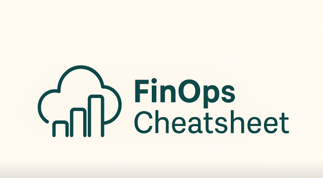

**Your fast-access, actionable resource for cloud cost optimization in AWS, GCP, Azure, and Kubernetes.**
Pragmatic, automation-friendly, and platform-agnostic—built for engineers, SREs, DevOps, and cross-functional FinOps teams.

## Why This Cheatsheet?

- **One central place** for code, tips, and anti-patterns
- **No sales, no fluff**—just what you need in daily cloud work
- **Open, modular, and ready to extend**

> _“You can’t optimize what you can’t measure.
Let’s make cloud costs transparent and actionable!”_

---

## Search & Snippets

- [AWS](./snippets/aws.md) | [GCP](./snippets/gcp.md) | [Azure](./snippets/azure.md) | [Kubernetes](./snippets/kubernetes.md)
- [PromQL](./snippets/promql.md) | [Terraform](./snippets/terraform.md) | [Bash](./snippets/bash.md)

---

## About & Contributions

- Created by practitioners, for practitioners.
- [How to contribute](https://github.com/AlexanderWiechert/finops-cheatsheet/blob/main/README.md) | License: MIT
  

